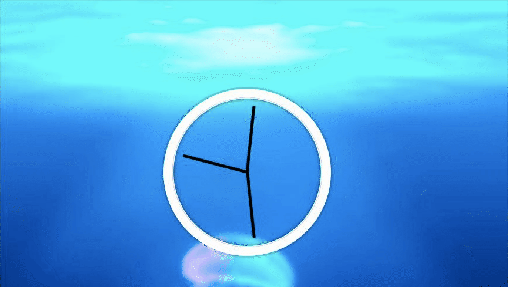

# Notes - JS and CSS Clock

[This was an interesting project from Wes Bos' Javascript 30 course ](https://javascript30.com/)

The task was to build an analog clock using CSS and JS.

The shape of the clock was built using CSS and its movement came from a combination of JS and CSS animations.

The below code set the clock hands to twelve o clock and the timing for the transition which makes them move.

    transform: rotate(90deg);
    transition-timing-function: cubic-bezier(0.1, 2.7, 0.58, 1);

This function access the date object and converts the current time in hours, minutes and seconds to degress on the clock face.

    function setDate(){
    const now = new Date();
    const seconds = now.getSeconds();
    const secondsDegrees = ((seconds/60)*360) + 90; 
    /*converts seconds to second hand movement in degrees. Need to add 90 to account for offset of clock hands*/
    secondHand.style.transform = `rotate(${secondsDegrees}deg)`;
    const minutes = now.getMinutes();
    const minutesDegrees = ((minutes/60)*360)+90;
    minuteHand.style.transform = `rotate(${minutesDegrees}deg)`;
    const hours = now.getHours();
    const hoursDegrees = ((hours/12)*360)+90;
    hourHand.style.transform =`rotate(${hoursDegrees}deg)`;
    }

## What I learned 
Completing this project taught me about methods for getting information from the data object:

- getMinutes()
- getSeconds()
- getHours()

I also thought using template strings to set the CSS transform property was really interesting:

    minuteHand.style.transform = `rotate(${minutesDegrees}deg)`;

## Transition property glitch
There was an interesting bug in this project where the transition timing function resets when the hands transition from 360 degrees to 0. One way to fix this would be to temporarily pause the tranistion at this point. 

## Accessibility
The page passed a Google Lighthouse audit with 100% but I struggled with making it accessibile to screen readers. There was no interactive element on the site to make it focussable. In addition all of the content was visual. 