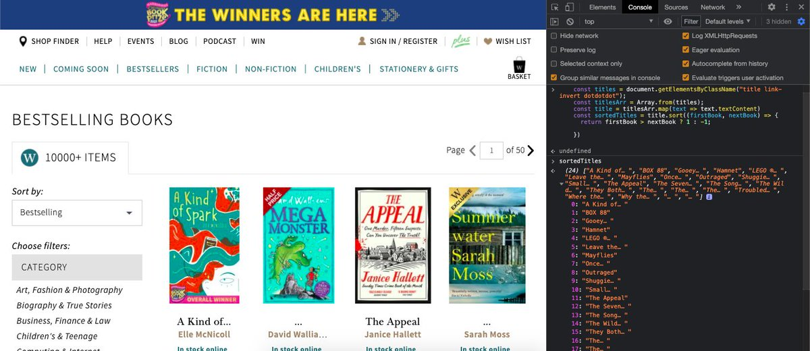

# Notes - Playing with CSS Variables and JS

[This project is taken from Wes Bos' Javascript 30 course ](https://javascript30.com/)

The purpose of this challenge was to implement common array methods. We took some initial data - an array of strings and an array of objects and used the following methods:

- Array.prototype.filter()
- Array.prototype.map()
- Array.prototype.sort()
- Array.prototype.reduce()

## What I learned 
In this challenge I learnt how to use the reduce method to total all the values in an array:

    const totalYears = inventors.reduce((total, inventor) => {
        return total + (inventor.passed - inventor.year);
        }, 0);
    
I also learn that I can use console.table() to display tabular data in the console.

## Extending the challenge

I wanted to see if I could apply the methods in this challenge to a real life use case. In this example outputting all the titles on the bestsellers page on the [Waterstones website](https://www.waterstones.com/books/bestsellers). These could then be sorted/filtered as desired.

I used getElementsByClassName() to grab all of the elements on the page that contained the title of the book.

Next I converted this NodeList into an array.

Then I used Array.sort to log the titles in alphabetical order to the console. 

    const titles = document.getElementsByClassName("title link-invert dotdotdot");
    const title = Array.from(titles.map(text => text.textContent))
    const sortedTitles = title.sort((firstBook, nextBook) => {
      return firstBook > nextBook ? 1 : -1;

    })

