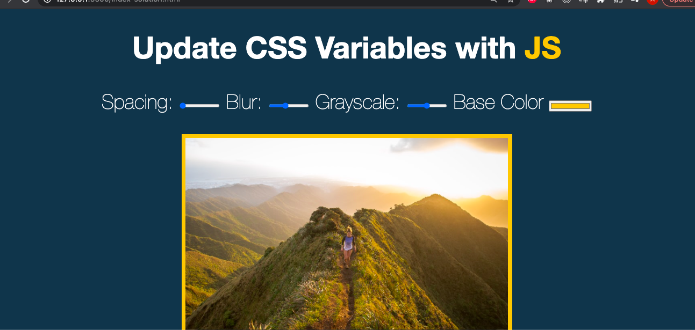

# Notes - Playing with CSS Variables and JS

[This project is taken from Wes Bos' Javascript 30 course ](https://javascript30.com/)

The focus of this challenge was to implement CSS variables that can be updated dynamically using JS.

We declared CSS variables in the :root CSS pseudo-class

    :root {
      --base: #ffc600;
      --spacing: 10px;
      --blur: 10px;
    }

Then we applied these to the image element

    img {
      padding: var(--spacing);
      background: var(--base);
      filter: blur(var(--blur))grayscale(var(--grayscale));
   
    }

The original challenge had one filter property on the image (blur). I added the grayscale property to extend it further.

We set the variables to update using a handleUpdate function. This function was added to an event listener that would fire on a change or mousemove event. 

We used style.setProperty to update the value for each property in the CSS.

    const inputs = document.querySelectorAll('.controls input');

    function handleUpdate() {
        const suffix = this.dataset.sizing || '';
        document.documentElement.style.setProperty(`--${this.name}`, this.value + suffix);
        }
    inputs.forEach(input => input.addEventListener('change', handleUpdate));
    inputs.forEach(input => input.addEventListener('mousemove', handleUpdate));

## What I learned
This challenge taught me how to use CSS variables to set a base style property that can be resued throughout a project.

I also learnt how to use input type attributes such as color 
<input id="base" type="color" name="base" value="#ffc600">
or range
<input id="grayscale" type="range" name="grayscale" value="0%" data-sizing="%">

## What I would do next
I would like to experiment further with dynamically setting CSS properties on a page. Maybe in response to a user event like click to access a high contrast colour version.

