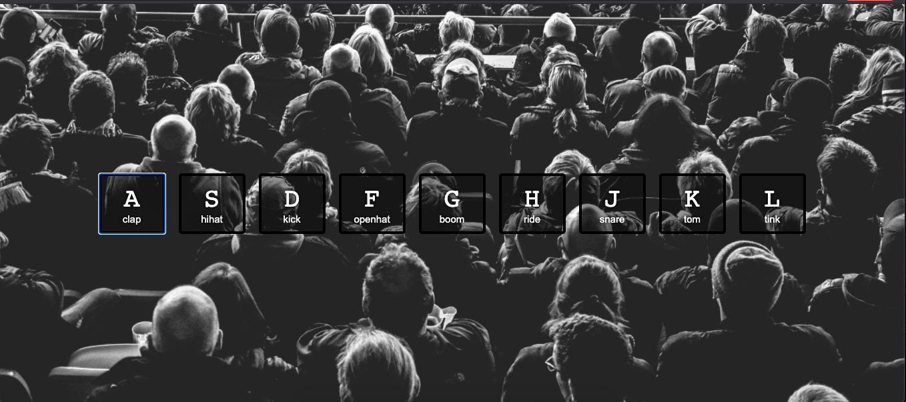
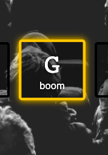

# Notes - Javascript Drum Kit

[This was the first day's project from Wes Bos' Javascript 30 course ](https://javascript30.com/)

The task was to build a drum kit that plays in the browser.

A data attribute is used to assign a [code](http://keycode.info/) to each of the tiles on the page. This code corresponds with a matching key on the keyboard.  

    <button data-key="65" class="key"
    <kbd>A</kbd>
    clap
    </button>

This playSound function creates an event that fires when the key is pressed:

    function playSound(e) {
        const audio = document.querySelector(`audio[data-key="${e.keyCode}"]`);
        const key = document.querySelector(`button[data-key="${e.keyCode}"]`);
        if (!audio) return;
        key.classList.add('playing');
        audio.currentTime = 0;
        audio.play();
    }

It uses querySelector to select an audio tag that plays the sound:

    <audio data-key="65" src="sounds/clap.wav"></audio>

There was additional CSS that added and removed an animation to each button when it was pressed and released.

## What I learned
During this project I learned about **data attributes** in HMTL. These allow us to store extra information on standard semantic HTML elements.

I also learnt about the **keyboard event object** for handling keyboard actions and the **transition end event** which is useful for detecting the end of a transition.

## Semantic HTML
I rewrote the divs in this project to a section element and some buttons. 

## Accessibility
As this project contained mostly audio/visual content I found it challenging to improve the accessibility. The page scored 100% on Google Lighthouse. 

Some other approaches I tried were:
* Replacing the divs with buttons to make them focussable using tab
* Adding aria labels to describe the content of the buttons and how to interact with the page.

