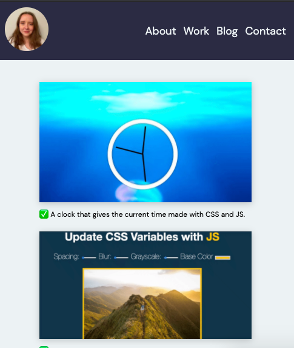

## Projects Galery Refactor

I revisited my projects gallery site from last week to see if any of it could be refactored.

This process was based on what I had learnt this week particularly on the topics of:

- CSS Architecture
- Responsiveness
- Pseudo selectors

### BEM vs Composition
Having read about the different ways of structuring CSS and seen examples of BEM (Block Element Modifider) and Composition I looked again at my CSS.

As this is still a small project I don't have a lot of style rules or a high degree of specificity on any of my selectors. 

I noticed that I was using combination selectors to style images within the grid:

        .box img {
            width: 100%;
            height: auto;
            box-shadow: 0px 3px 15px rgba(0, 0, 0, 0.2);
        }
and that if my CSS became larger this would be a good place for BEM.

I also realised that there was some repitition in my CSS - for example I was adding padding individually on two seperate elements - and that this could be a good place for a layout primitive using the composition model.

### Responsiveness
Due to using CSS grid and relative units much of my layout is inherently responsive. 

I didn't begin the design with mobile first however, and if I had I would probably had some menu elements hidden at this screen size.

### Pseudo Selectors
I decided to see if I could incorporate a :before pseudo selector on all the parargraph elements on my site. In this case I chose to use an emoji in the content property:

        p:before {
        content: "✅ ";
        }

In another project this week I used the :root pseduo class selector to implement a dark mode using CSS variables.
