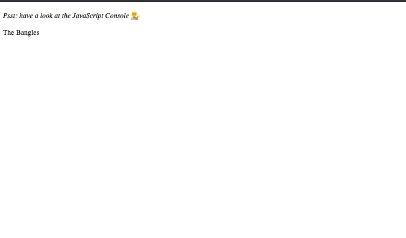
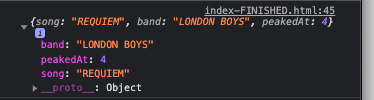

# Notes - Array Cardio Day 2

[This project is taken from Wes Bos' Javascript 30 course ](https://javascript30.com/)

The purpose of this challenge was to implement some more common array methods. We took some initial data - two arrays of objects and used the following methods:

- Array.prototype.some()
- Array.prototype.every()
- Array.prototype.find()
- Array.prototype.findIndex()

## What I learned 
In this challenge I learnt that I can use .find() which returns a boolean to find out if a specific item is in an array. 

I also learnt that .findIndex() returns the index of an item, which, when combined with .splice(), can be used to remove it from the array.

I learnt the difference between .some() and .every() and how to use the spread operator to combine parts of an array into a new array. This leaves the original unchanged:

    const index = comments.findIndex(comment => comment.id === 823423);
    
    comments.splice(index, 1);

    const newComments = [
      ...comments.slice(0, index),
      ...comments.slice(index + 1)
    ];

Using an array of hit songs from 1989 (the year I was born) I 
used .some(), .every() and .find() to write data to the page as well as log it in the console:

        const hitsOf1989 = [
            {song: "RIDE ON TIME", band: "BLACK BOX", peakedAt: 1},
            {song: "SWING THE MOOD", band: "JIVE BUNNY & THE MASTERMIXERS", peakedAt: 1},
            {song: "ETERNAL FLAME", band: "BANGLES", peakedAt: 1},
            {song: "LOVE CHANGES EVERYTHING", band: "MICHAEL BALL", peakedAt: 2},
            {song: "REQUIEM", band: "LONDON BOYS", peakedAt: 4},
            ]

        function isBangles(){
            if (hitsOf1989.some(band => (band.band !== "BANGLES")))
            return "The Bangles"
        
            };

            document.getElementById("my-output").innerHTML = isBangles();

This outputted to:

I wrote a function to find the song that had peaked at number 4 on the charts and console.log it:

    function findNumber4 (){
      const peakedAt4 = hitsOf1989.find((song => song.peakedAt == 4))
      console.log(peakedAt4)
    }

    findNumber4()

The result was below:

