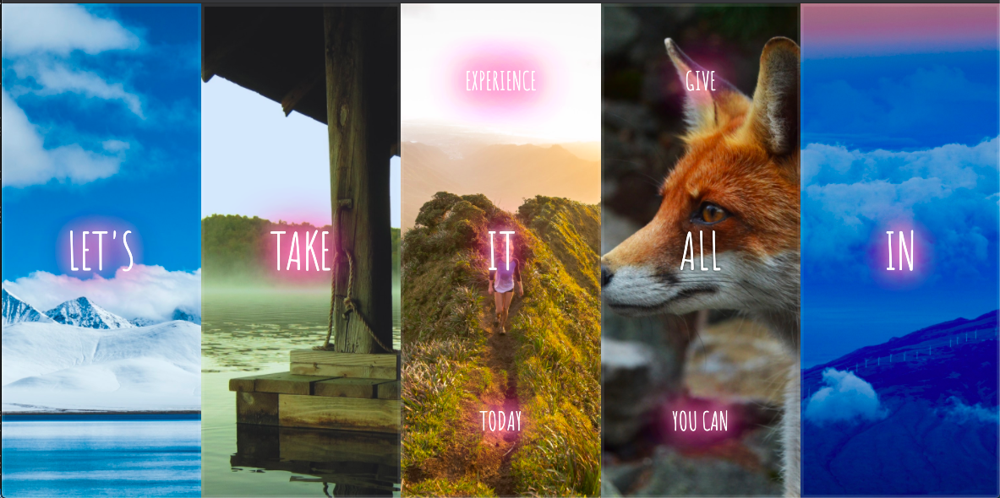

# Notes - Flex Panels Image Gallery

[This project is taken from Wes Bos' Javascript 30 course ](https://javascript30.com/)

The objective of this project was to open an image panel and display hidden text on a mouse event with CSS and JS.

We started with a series of panels each with a property of flex 1 so they divided the available space between them evenly. The flex direction was column meaning that the child elements were arranged vertically.

    {...
      flex: 1;
      justify-content: center;
      display: flex;
      flex-direction: column;
    }

A transform: translateY() animation was applied to the child elements of the panels (the text). This pushed them on and off the screen vertically.

    .panel > *:first-child { transform: translateY(-100%); }
    .panel.open-active > *:first-child { transform: translateY(0); }
    .panel > *:last-child { transform: translateY(100%); }
    .panel.open-active > *:last-child { transform: translateY(0); }

We then wrote a function to select all the panels and apply the class 'open' on a mouse event:

    const panels = document.querySelectorAll('.panel');
    
    function toggleOpen() {
      this.classList.toggle('open');
    }

The below adds an EventListener on the panels which fires on a mouseover event (in the original project it was a click). 

    panels.forEach(panel => panel.addEventListener('mouseover', toggleOpen));

We used the below to listen for the transitionend event on the panels and apply the class 'open-active':

    function toggleActive(e) {
      if (e.propertyName.includes('flex')) {
       this.classList.toggle('open-active');   
      }
    }

    panels.forEach(panel => panel.addEventListener('transitionend', toggleActive));

This triggered the transform animation referenced above.

As an extension to this project I added a glow CSS animation on mouseover 

    const glow = document.querySelectorAll('.glow ');
    function toggleGlow() {
      this.classList.toggle('glow');
     
    }

    glow.forEach(glow => glow.addEventListener('mouseover', toggleGlow));

A glow class was added to each p element within the panels

    
Hey

    
Let's

    
Dance

If I revisit this project I would like to find a less repetitive way to apply this animation.