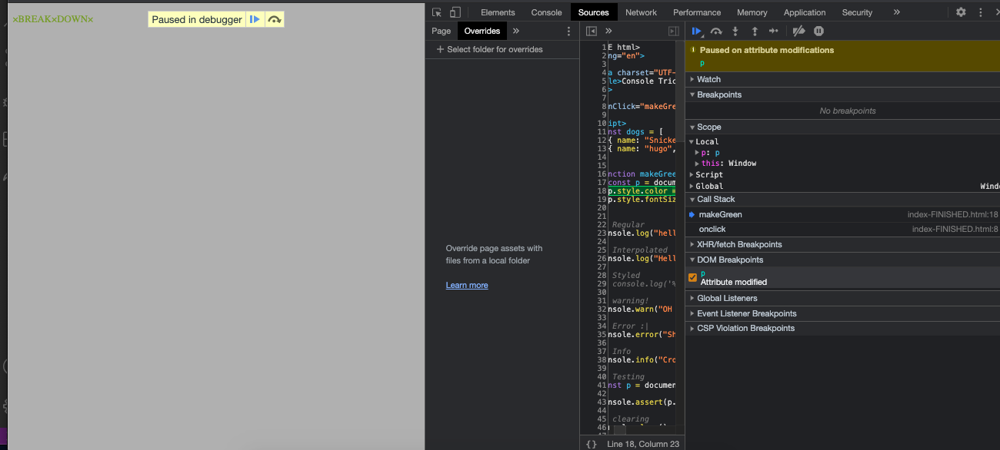
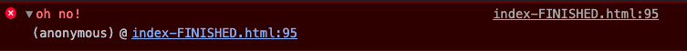
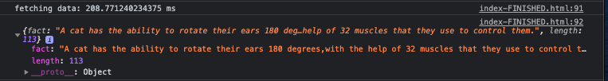
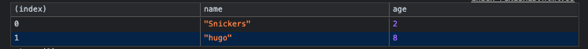

# Notes - Dev Tools Domination

[This project is taken from Wes Bos' Javascript 30 course ](https://javascript30.com/)

This was a fun video running through some lesser known tricks in the dev tools and in particular the console. This is a non-exhaustive list of my favourites.

When we inspect an element in the console we can right click on it and set a DOM change breakpoint (in this case on attribute modifications). This will allow us to see the line in the code that is running on the page:

There is of course the regular

    console.log("Hello")

but it is also possible to interpolate variables using %s

    console.log("Hello I am a %s string!", "💩");

(This has now been mostly replaced by the ES6 backticks syntax)

    console.error()

logs a warning to the console:

The console can also be used for testing. The below code asserts that p will have a classname which contains "ouch".

A second argument, in this case a string, is passed to the function to be logged if the test fails:

    const p = document.querySelector("p");
      console.assert(p.classList.contains("ouch"), "That is wrong!");

console.time() tells us how long a function takes to run in the console

    console.time("fetching data");
      fetch("https://catfact.ninja/fact")
        .then((data) => data.json())
        .then((data) => {
          console.timeEnd("fetching data");
          console.log(data);
        });

In this example it took to display a cat fact from the catfact api

One method for making output easier to read in the console is to use console.group and console.groupCollapsed:

    dogs.forEach((dog) => {
        console.groupCollapsed(`${dog.name}`);
        console.log(`This is ${dog.name}`);
        console.log(`${dog.name} is ${dog.age} years old`);
        console.log(`${dog.name} is ${dog.age * 7} dog years old`);
        console.groupEnd(`${dog.name}`);
      });

We can use console.count() to count how many times something is logged.

Finally, console.table() provides us with a neat way to view data like this dogs array:

      const dogs = [
        { name: "Snickers", age: 2 },
        { name: "hugo", age: 8 },
      ];

