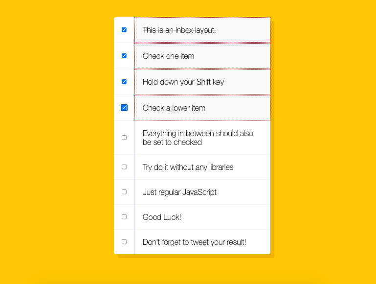
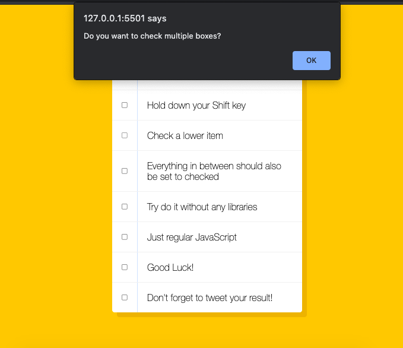

# Notes - Hold Shift to Check Multiple Checkboxes

[This project is taken from Wes Bos' Javascript 30 course ](https://javascript30.com/)

This goal of this project was to create a UI where a user could check the checkbox on multiple divs by holding down shift.

We started with a series of divs all with an input type of checkbox.

We stored all of these inputs in a variable:

    const checkboxes = document.querySelectorAll(
        '.inbox input[type="checkbox"]'
      );

Then we added an event listener to run the handleCheck function whenever a checkbox is clicked:

    checkboxes.forEach((checkbox) =>
        checkbox.addEventListener("click", handleCheck)
      );

The handle check function is where most of our code runs.

We initalised the inBetween variable as false.

Then we used an if statement to check if there had been a shift key event and also that the user is checking the box:

      function handleCheck(e) {
        let inBetween = false;
        if (e.shiftKey && this.checked) {

If both of these conditions were true we looped through each checkbox.

If the checkbox was the current checkbox OR it was the value stored in the lastChecked variable we toggled inBetween:

    checkboxes.forEach((checkbox) => {
    if (checkbox === this || checkbox === lastChecked) {
    inBetween = !inBetween;
    }

The reason that we use !inBetween here instead of false is that we wanted the user to be able to check the divs in both directions (from top to bottom and from bottom to top).

If inBetween was true we set the checkbox property of checked to true:

         if (inBetween) {
              checkbox.checked = true;
            }
          });
        }

        lastChecked = this;
      }

This applies the styles that we declared in our CSS

      input:checked + p {
        background: #f9f9f9;
        text-decoration: line-through;
        border: 1px red dotted;
      }

As an extenstion to this project I added a red warning border around the checked divs.

I also added an alert at the top of the function (ie before the forEach loop to stop it happening multiple times) to ask the user if they wanted to check multiple multiple boxes.

