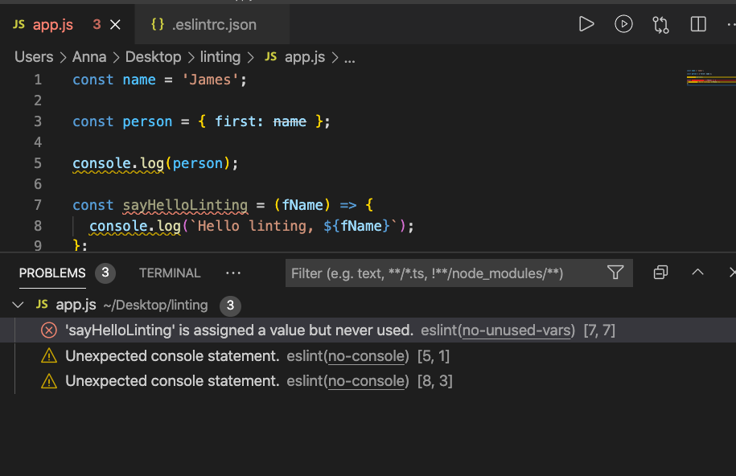

# Notes for Tech Spikes questions - week 4

## Prettier

1. What is Prettier? How might it help us write better code?

   Prettier is a code formatter that removes \*all original styling and imposes consistent style rules across our code.

   Prettier removes the time we might otherwise spend manually formatting our code.

   It makes code easier to read and understand. It helps newcomers to a codebase.

   We can use in-built style guides such as AirB&B and avoid having to create our own from scratch.

   Prettier doesn't catch code quality errors but by making our code more readable it makes us more likely to see them.

\*(almost all)

## ESLint

1. How can a linter help us avoid bugs?

   Linting tools like ESLint help us to discover problems with our JavaScript code.

   Linting is a type of analysis that searches for problematic patterns or code that doesn't adhere to certain style guidelines.

   Javascript is a loosely typed and dynamic language meaning that it is especially prone to developer error.

   ESLint was created was to allow developers to create their own linting rules.

   When we initialise ESLint as a dev dependency in our projects we can use default/standard configurations or create our own.

   Unlike Prettier, ESLint and other linters find bugs in our code. 

   We should use Prettier for style rules and ESLint for debugging.

   The advantage of installing ESLint is that we can find bugs before the code is executed.

   