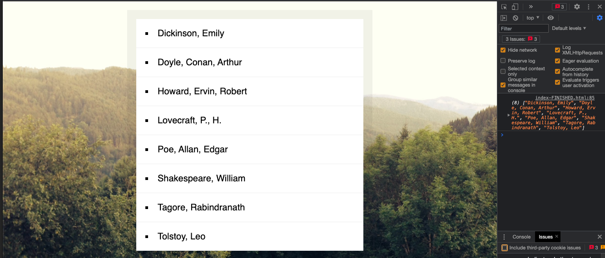

# Notes - Sorting band names without articles

[This project is taken from Wes Bos' Javascript 30 course ](https://javascript30.com/)

In this project Wes showed how to implement a sort function without including the articles (a, an, the).

We started with an array of band names:

        const bands = [
            'The Plot in You',
            'The Devil Wears Prada',
            'Pierce the Veil',
            'Norma Jean',
            'The Bled',
            'Say Anything',
            'The Midway State',
            'We Came as Romans',
            'Counterparts',
            'Oh, Sleeper',
            'A Skylit Drive',
            'Anywhere But Here',
            'An Old Dog',
        ];

We could use a regular `sort` function like the below:

    arr.sort((a, b) => (a > b ? 1 : -1));

The problem with this is that it would sort each of the strings in the array alphabetically including words like a, an, or the.
These types of words (articles) wouldn't usually be taken into account when sorting alphabetically.

So Wes wrote a function:

        function strip(bandName) {
            return bandName.replace(/^(a |the |an )/i, '').trim();
        }

that would find and remove these words from the array - in this case replacing them with nothing - and trim any whitespace.

Now he can pass this `strip` function into his sort

    const sortedBands = bands.sort((a, b) => (strip(a) > strip(b) ? 1 : -1));

and get the correct result:

I was interested to see if I could extend on this project by creating my own list of sorted author names.

Like Wes, I created an initial array to store my data:

        const authors = [
            'William Shakespeare',
            'Emily Dickinson',
            'H. P. Lovecraft',
            'Arthur Conan Doyle',
            'Leo Tolstoy',
            'Edgar Allan Poe',
            'Robert Ervin Howard',
            'Rabindranath Tagore',
        ];

I wanted to sort my authors by last name so I wrote this function to reverse the names:

      function reverseNames(arr) {
        let result = [];
        for (i = 0; i < arr.length; i++) {
          result.push(arr[i].split(' ').reverse().join(', '));
        }
        return result;
      }

Then I was able to store them in a variable, sort them and re-insert them into the DOM

    const reversed = reverseNames(authors);

    const sortedAuthors = reversed.sort((a, b) => (a > b ? 1 : -1));

    document.querySelector('#bands').innerHTML = sortedAuthors
        .map((author) => `<li>${author}</li>`)
        .join('');

This was the output:

I would like to write a RegEx that would handle the cases where an author has a middle name or initials as their first name.
