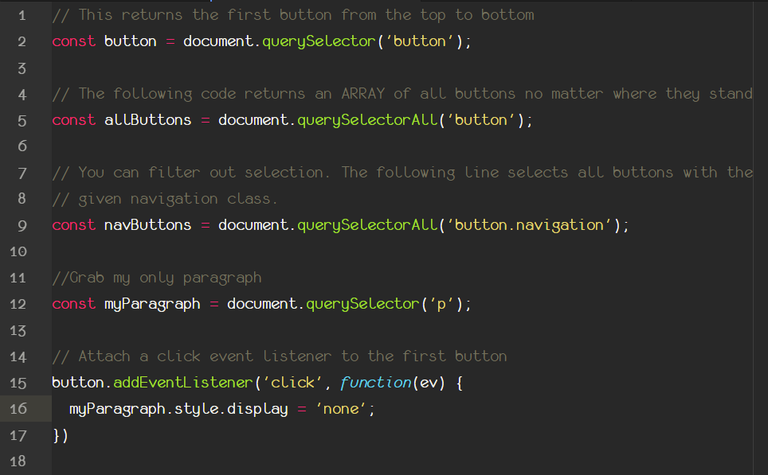

# Notes for Tech Spikes questions - week 5

## Advanced DOM 🤔

How can we use advanced DOM features to make rendering complex UIs easier?

Questions to consider:

1. What is a NodeList? How is it different from an array?

   NodeList objects are collections of nodes, usually returned by properties such as `Node.childNodes` and methods such as `document.querySelectorAll()`.

   Although NodeList is not an Array, it is possible to iterate over it with `forEach()`. It can also be converted to a real Array using `Array.from()`.

   \*NB some older browsers have not implemented `NodeList.forEach()` nor `Array.from()`. This can be circumvented by using `Array.prototype.forEach()`.

`NodeList.length`: The number of nodes in the NodeList.

`NodeList.item()`
Returns an item in the list by its index (or null if index doesn't exist).

`NodeList.forEach()`
Executes a provided function once per NodeList element, passing the element as an argument to the function.

2. What’s the different between “live” and “static” NodeLists?

   There are two varieties of NodeList: <em>live</em> and <em>static</em>.

   When a NodeList is <em>Live</em> changes in the DOM automatically update the collection. **This can change it's length.** `Node.childNodes` is <em>Live</em>.

   On the other hand `document.querySelectorAll()` returns a static NodeList. This collection is not updated by changes in the DOM.

3. What is the `<template>` element? How can we use this to render dynamic UIs?

   The `<template>` HTML element is a mechanism for holding HTML that will not be rendered immediately when a page is loaded but may be instantiated subsequently during runtime using JavaScript.

   We can think of a template as a content fragment that is being stored for subsequent use in the document. While the parser does process the contents of the `<template>` element while loading the page, it does so only to ensure that those contents are valid; the element's contents are not rendered, however.

   We can render different UI components based on any condition/state that could be evaluated by Javascript. Some use cases include user location, device, or user interaction with the page.

   We can dynamically plug in elements based on a static HTML structure stored in a `<template>`. This can save us multiple lines of code [as we can see in this example](https://codepen.io/oliverjam/pen/yLNEOQO?editors=1010).
