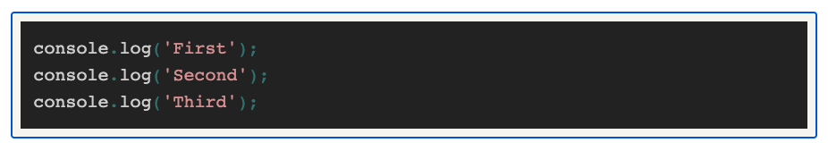

# Notes for Tech Spikes questions - week 7

## Asynchronous JavaScript ⌛

How does JS handle asynchronous code?

Questions to consider:

1. What’s the difference between “synchronous” and “asynchronous” code? Why might synchronous code be called “blocking”?

In programming, we can simplify the definition of synchronous code as “a bunch of statements in sequence”; so each statement in your code is executed one after the other. This means each statement has to wait for the previous one to finish executing.

The statements above will execute in order, outputting “First”, “Second”, “Third” to the console. That’s because it’s written <strong>synchronously</strong>.

<strong>Synchronous</strong> code has the potential to block further execution until it has finished what it’s doing. Long-running JavaScript functions can make the UI or server unresponsive until the function has returned. This can result in a terrible user-experience.

Luckily, the browser provides us with a set of APIs that we can use to write <strong>asynchronous</strong> code.

There are two main types of asynchronous code styles in JavaScript:

- callbacks:

  are functions that are specified as arguments when calling a function which will start executing code in the background. When the background code finishes running, it calls the callback function to let you know the work is done, or to let you know that something of interest has happened.

- promises:

Async operations like promises are put into an event queue, which runs after the main thread has finished processing so that they do not block subsequent JavaScript code from running. The queued operations will complete as soon as possible then return their results to the JavaScript environment.

2. What are the event loop and the call stack?

The <strong>call stack</strong> is a LIFO queue (Last In, First Out).

The <strong>event loop</strong> continuously checks the call stack to see if there’s any function that needs to run.

While doing so, it adds any function call it finds to the call stack and executes each one in order.

If there is nothing to run in the call stack JavaScript will check the <strong>event queue</strong> for scheduled callbacks and promises and add these to the stack.

3. How do callbacks and promises help us?

Both callbacks and promises allow us to schedule operations to run later - either as soon as possible or as soon as possible after a specified time (e.g. 500ms). This means that we can perform slow operations like network requests or reading files without blocking the UI.

Promises are generally considered preferable to callbacks in newer code because they avoid the problem of <strong>inversion of control.</strong>
