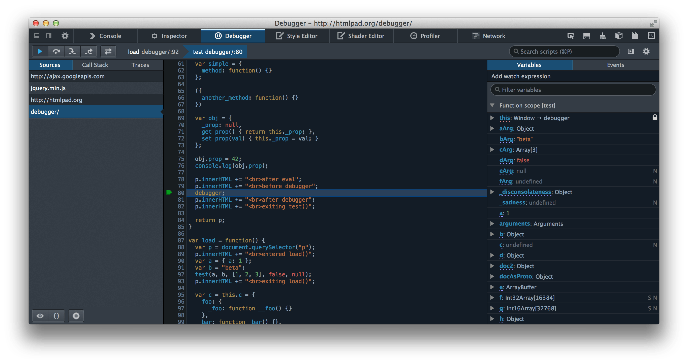

# Notes for Tech Spikes questions - week 7

## Debugging JavaScript 🐛

How would you effectively find out where (and why) an error is occurring in your JavaScript code?

Questions to consider:

1. What console methods are there other than console.log? Can these help us debug?

The most common element of the console object is `console.log`

There are four different ways of outputting a message to the console:

1. `log`
2. `info`
3. `warn`
4. `error`

These visual differences help identify any errors or warnings in the console at a quick glance.

Template literals can be used to log variables inside strings. They use backticks (``) instead of quotation marks and variables go inside ${}

    const a = 'some value';

    console.log(`here is my value: ${a}`);

    // here is my value: some value

`Assert()`
The assert method writes an error message to the console if the assertion is false. If the assertion is true, nothing happens.

`Dir()`
The dir method displays an interactive list of the object passed to it.

`Table()`
The table method displays an array or object as a table.

`Time()`
The console. time() method starts a timer you can use to track how long an operation takes.

`Group()`
The console. group() method creates a new inline group in the Web console log. This indents following console messages by an additional level, until console. groupEnd() is called.

    console.group("URL Details");
    console.log("Scheme: HTTPS");
    console.log("Host: example.com");
    console.groupEnd();

2. What does the `debugger` statement do?

The `debugger` statement invokes any available debugging functionality (such as setting a breakpoint).

If no debugging functionality is available, this statement has no effect.

The below code uses a `debugger` statement to invoke a debugger (if it exists) when the function is called:

    function potentiallyBuggyCode() {
        debugger;
        // do potentially buggy stuff to examine, step through, etc.
    }

The code execution is paused at the debugger statement. It is like a breakpoint in the script source.

3. How do we use the debugger in our browser?

Debugging is the process of finding and fixing errors within a script.

Debugging tools are a special UI available in the broswer. They allow us to trace the code step by step to see what exactly is going on.

We can examine the code at a specific point in its execution using breakpoints

While the code is paused, we can examine current variables, trace the callstack, execute commands in the console etc.

A full overview of Chrome debugging tools is here https://developer.chrome.com/docs/devtools/
