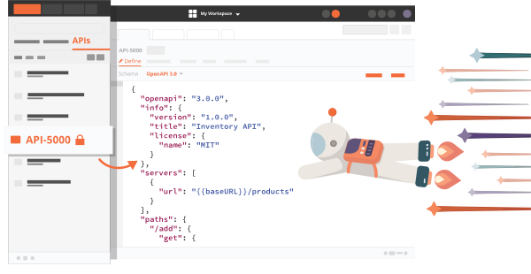

# Notes for Tech Spikes questions - week 7

## Debugging Network Requests 🌐

How can we send and receive test network requests while working on an application?

Questions to consider:

1. How can we inspect any requests the browser is making on an HTML page?

We can the Network panel in Dev Tools when we need to make sure that resources are being downloaded or uploaded as expected.

The most common use cases for the Network panel are:

- Making sure that resources are being uploaded or downloaded.
- Inspecting the properties of an individual resource, such as its HTTP headers, content, size, and so on.

The Network panel logs all network activity in the Network Log.

The log shows us the following information for each resource:

- Status: The HTTP response code.

- Type: The resource type.

- Initiator: What caused a resource to be requested.

- Time: How long the request took.

and much more.

A few other useful tools in the network panel are:

- simulating the page load with a slower internet connection (known as throttling)
- blocking requests to see what the page would look like (or if it would be functional) if certain resources failed to load
- searching the HTTP headers and responses of all resources

2. How can we manually send test requests outside of our browser?

We can use tools like Insomnia

and Postman

to manually test network requests outside of our browser.
